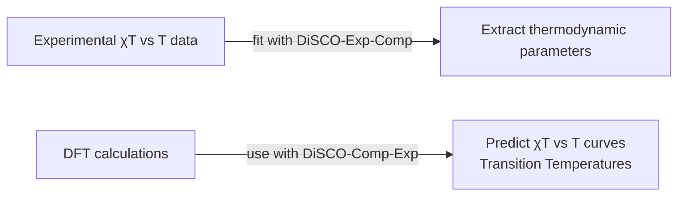

# DiSCO: Dinuclear Spin-Crossover properties prediction scripts  

This repository contains a set of Python codes to study the **spin-crossover (SCO) properties of dinuclear systems**, based on the theoretical framework described in the paper:  

**[“Tuning the spin-crossover properties of [Fe₂] metal–organic cages”](https://doi.org/10.1039/D4DT01213E)** 

The goal of these codes is twofold:  

1. **[DiSCO-Exp-Comp](./DiSCO-Exp-Comp/)**  
   Fit **experimental magnetic susceptibility data** to extract the **thermodynamic parameters** of the SCO transition using the **Slichter–Drickamer model**.  

2. **[DiSCO-Comp-Exp](./DiSCO-Comp-Exp/)**  
   Start from **thermodynamic quantities obtained from DFT calculations** and **predict the experimental spectra** (χT vs T plots, transition temperatures, etc.).  

Together, these two approaches allow a full cycle: **from experiment to theory** and **from computation to experiment**.  

---

## 📑 Table of Contents  

1. [Requirements](#1-req)  
2. [Repository Structure](#2-struct)  
3. [Usage](#3-usage)  
4. [Help & Support](#4-help)  

---

## ⚙️ Requirements  

- **Python** (≥ 3.11)  
- Required modules:  
  - `numpy`  
  - `plotly`  
  - `scipy`  
  - `os`, `sys`  

---

## 📂 Repository Structure  

- **DiSCO/**
  - **DiSCO-Exp-Comp/** — Experimental → Computational approach  
    - `code`  
    - `input_files`  
    - `output/`  
    - `README.md`  
  - **DiSCO-Comp-Exp/** — Computational → Experimental approach  
    - `code`  
    - `input_files`  
    - `output/`  
    - `README.md`  
  - `README.md` — Main project documentation  

Each subfolder contains:  
- **Code** for running the simulations.  
- **Input files** with the required parameters or data.  
- **Examples** to help you get started.  
- A **README** explaining how to use that module.  

---

## ▶️ Usage  

The two workflows require different inputs and provide different outputs:  

### 🔹 [DiSCO-Exp-Comp](./DiSCO-Exp-Comp/)  

- **Input:**  
  - A file with experimental χT vs T data.  
  - A `parameters.dat` file with initial guesses of the thermodynamic parameters (ΔH, ΔS, W, γ) as well as the theoretical maximum and minimum χT value.  

- **Output:**  
  - Optimized values of ΔH, ΔS, W, γ.  
  - Plot of experimental vs fitted χT curves stored in `/output/`.   

---

### 🔹 [DiSCO-Comp-Exp](./DiSCO-Comp-Exp/)  

- **Input:**  
  - A `parameters.dat` file with general settings (Tini, Tfin, dT, print_txt).  
  - An `input.dat` file with thermodynamic parameters (ΔH, ΔS, ΔH₁, ΔS₁, γ) for one or multiple systems.  

- **Output:**  
  - Transition temperatures (T1/2, QS–SS, QQ–QS).  
  - Classification of the transition (one-step or two-step).  
  - Plots of χT vs T, molar fractions, and heat capacity saved in `/output/`.  
  - Numerical results saved in `.txt` format if `print_txt=1` in the input.  

---

### 🔄 Workflow Diagram  
**Explanation:**  
- If you have experimental χT vs T data, run **DiSCO-Exp-Comp** to *extract* thermodynamic parameters (ΔH, ΔS, W, γ).  
- If you have DFT/computational thermodynamic parameters, provide them to **DiSCO-Comp-Exp** to *predict* experimental χT vs T curves and obtain transition temperatures.  

---

## ❓ Help & Support

⚠️ **Disclaimer:** These scripts were developed by a **PhD student in training** and may not be suited for general-purpose calculations.

For any doubts, questions or issues, feel free to contact [me](mailto:arnau.garcia@ub.edu)
